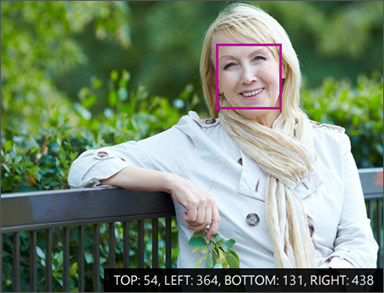
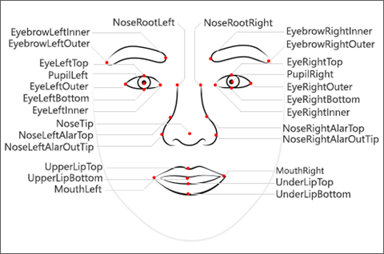
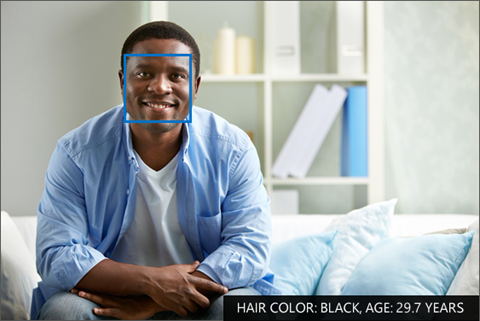
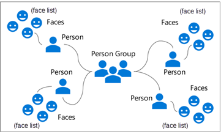
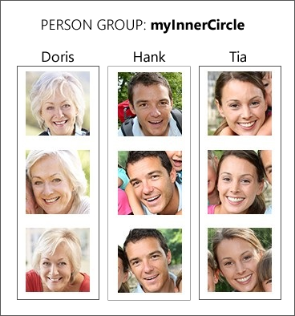

# Section 3: Face API and AI considerations and ethics

Facial recognition provides a good context for discussing the ethics of AI because everyone has a face. Earth is filled with more than 7,500,000,000 faces, and although faces change over time with age and other conditions, the human brain excels in its ability to detect, identify, and recognize faces. AI has made remarkable strides in facial recognition as well, sometimes exceeding human capabilities. Automating facial recognition opens new opportunities and also poses new risks, which makes the discussion of ethics an important part of learning about AI.

## Introduction to the Face API: The Emotion API

One of the more common challenges companies look to solve revolves around facial recognition. This could be apps which allow for a form of mixed reality, where hats or other features are placed on a face. Or maybe you're looking to guess how someone is feeling at the moment to track feedback. Or, of course, you might be looking to determine who someone is in a picture. Microsoft Face API can help you with all of those challenges.

## The Face API: How it works

As a developer, you interact with Microsoft's facial recognition algorithms through an API. As with all other Microsoft Cognitive Services, Face API is available via a REST-based web service, allow you to detect, verify, identify and analyze faces. The service can provide face matching and characteristic analysis. It can also extract face related attributes such as emotion, or group people and facial definitions together to locate similar faces.

The tasks performed by Face API fall into five categories:

- **Detection**: Detect the existence and location of faces in an image
- **Similarity**: Find similar faces in an image
- **Grouping**: Organize unidentified faces into groups based on their visual similarity
- **Identification**: Search and identify faces

### Types of facial data

Face API returns three kinds of facial data: the locations, the landmarks (such as ears and nose), and the attributes (such as emotion).

#### Location

A face location is the coordinates of where a face has been identified in an image. The location is a rectangular pixel area in the image. The coordinates consist of top, left, bottom, and right edges of the region which contains the face.

#### Landmarks

Face landmarks are the detailed points on a face. Collections of these points (such as the chart below) provide rough sketches of individual human faces. These landmarks identify common facial elements, such as a pupil, nose or eyebrow, by using pixel coordinates. Face API can return up to 27 landmarks for each identified face, all of which can be used for analysis.

#### Attributes

Face attributes are predefined properties of a face or properties that identify a person by a face. The API can optionally identify the following types of attributes:

- Age
- Gender
- Smile intensity
- Facial hair
- Head pose (3D)
- Emotion

### Overview of facial recognition

The face-detection feature of Face API provides information about detected faces in an image, but it isn't designed to identify or recognize a specific face. However, Face API offers this capability through a facial recognition feature.

Facial recognition is used in many areas, including security, natural user interfaces, image analysis, mobile apps, and robotics. The ability to use artificial intelligence to recognize and match faces is one of the more powerful aspects of Face API. It is also an aspect of AI which encapsulates many ethical questions, which we will discuss later in this section.

#### Facial detection vs facial recognition

Facial recognition builds on the facial detection functionality by analyzing the landmarks in two or more pictures to determine whether the same face is present. There are four assessments which can be determined:

- Does this person look like other people? (Similarity)
- Do all these faces belong together? (Grouping)
- Do two images of a face belong to the same person? (Verification)
- Who is this person in this group of people? (Identification)

#### Training facial recognition

In order to identify faces, Face API needs to be trained. When setting up Face API for recognition, you will create a Person Group, one or more Persons, and Faces.

##### Person Group

A person group is a collection of people you wish to identify. Facial recognition works in a closed universe; it is only able to identify the people and faces you've trained. By creating person groups, you can create separate models for facial recognition, and manage each one individually. A person group has a name and ID which you provide (these can be the same), and contains one or more persons.

##### Person

A person is someone you wish to identify in the group. A person has a name (as you might have expected), and a collection of faces known as a face list.

##### Face

A face is an image of the person you wish to use to train the model. When uploading images, ensure there is only one person in the photo. You will also want to ensure you train the model with multiple images of the person, in different lighting and settings.

#### Face identification

You can use Face API to identify people by comparing a detected face to a person group. Remember, the person group is like a database of people, and only people in the database will be identified. You might train up a model with three people like demonstrated below.

#### Face similarity

Face lists are a great way to determine face similarity. For example, if you compare a target face against a face list, Face API might return a small collection of faces which look similar to the target face. Face API supports two working modes:

- **Match person**, which returns similar faces after applying a same-person threshold derived from face verification
- **Match face**, which returns similar faces by ignoring the same-person threshold

## Considerations for face data

The AI capabilities we've examined form the building blocks for more complex activities for which facial detection and recognition can be used. Capabilities like these bring great power and, of course, great responsibility.

Consider a real-life example of facial recognition. The London Metropolitan Police Service concluded the last of 10 trials of its [Live Facial Recognition (LFR) technology in July 2019](https://www.met.police.uk/live-facial-recognition-trial/). The technology was designed to tie together real-time facial recognition to spot individuals on police watch lists. However, an independent review of the trials conducted by researchers at Essex University indicate [only 8 of the 42 matches made by LFR technology were true-positive](https://48ba3m4eh2bf2sksp43rq8kk-wpengine.netdna-ssl.com/wp-content/uploads/2019/07/London-Met-Police-Trial-of-Facial-Recognition-Tech-Report.pdf). What went wrong?

### Issues with bias

The researchers at Essex University who reviewed the performance could not rule out the possibility of bias in the system. Researchers from Massachusetts Institute of Technology (MIT) documented poor [accuracy for commercial facial-recognition](http://gendershades.org/overview.html) software when attempting to identify dark-skinned women.

The source of data, such as how the faces were gathered, can be a source of bias. For example, a model trained in a college lab using collegiate faces would encounter difficulties when used with children or the elderly. Even models built using representative data from a given population might struggle to detect minorities or other underrepresented demographic groups.

### Necessity of large and varied data sets

Facial recognition is a prime example of the essential rule of AI: good data makes good models. Conversely, biased data makes biased models. Avoiding accuracy problems arising from biased data sourcing comes down to having a sufficiently large and varied data set.

One of the exciting promises of AI is its ability to offer unique insights which humans would find difficult to tease out of data unaided. But AI is only as good as the data from which it is built. A question you m,ust constantly ask yourself when working with face data (or any kind of data) is "Do I have enough examples of edge cases?" Without addressing outliers, any model you build will struggle to identify unlabeled examples which fall outside the expected.

One final thought on bias: Microsoft was one of the commercial AI providers whose algorithms were noted by researchers from MIT as being highly inaccurate in recognizing dark-skinned female faces. After an update to the algorithm (and training data), Microsoft's [error rate dropped to less than two percent](http://www.aies-conference.com/wp-content/uploads/2019/01/AIES-19_paper_223.pdf). It is always possible to identify bias and improve results.
