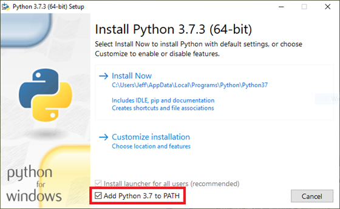

# Set up a development environment

[Prerequisite: Getting started](../2-computer-vision-text-analytics.md)

The first order of business is to setup a development environment for Python, and to install the tools for managing Azure.

## Install Python and create a virtual environment

If you already have Python installed, you can skip ahead to the bottom of this document where you'll install the Azure CLI, which we'll be using to manage our Azure resources.

1. If Python 3.6 or higher isn't already installed on your computer, you can install it by visiting [python.org](https://python.org) and following the installation steps. If you're not sure if it's installed, you can test it by running the following command. If Python is installed the version number will appear in the console window.

``` bash
# Windows
python --version

# macOS or Linux
python3 --version
```

> **Note** If you do need to install Python, ensure you select the option to *Add Python 3.x to PATH*



2. Upgrade to the latest version of `pip`, the Python package manager.

``` bash
# Windows
python -m pip install --upgrade pip

# macOS or Linux
python3 -m pip install --upgrade pip
```

## Install the Azure Command-Line Interface (CLI)

The [Azure CLI](https://docs.microsoft.com/cli/azure/get-started-with-azure-cli?view=azure-cli-latest) is a command-line environment for creating and managing Azure resources. Versions are available for Windows, macOS, and Linux. In subsequent unites you'll use the Azure CLI to create various Azure resources. Here you will install the Azure CLI and login to Azure.

1. If you haven't already installed Azure CLI, visit the [Azure CLI web page](https://docs.microsoft.com/en-us/cli/azure/install-azure-cli?view=azure-cli-latest) and follow the installation instructions. You can determine if it's already installed by running `az -v` in a console window, which will display the verson number.

2. Login to Azure using the Azure CLI. The process will be completed using a browser window (the command will automatically open it); the browser can be closed once login is complete.

``` bash
az login
```

3. **optional** You may have multiple subscriptions for Azure associated with your account. We will be using the default subscription. If you aren't sure which one the Azure CLI is using, or you need to change it, you can use the following commands.

``` bash
# List all subscriptions
az account list

# Change the default (if needed)
az account set -s <SUBSCRIPTION_ID>
```

If you aren't familiar with the Azure CLI, you can learn more about it and the numerous commands it supports in [Get started with Azure CLI](https://docs.microsoft.com/en-us/cli/azure/get-started-with-azure-cli?view=azure-cli-latest). Most operations in Azure can be performed by using either the CLI or the [Azure Portal](https://portal.azure.com). Power users tend to prefer the CLI, in part because CLI commands can be used in scripts to automate repetitive tasks.

## Summary and next steps

We now have Python and the Azure CLI installed. We also have the environment setup for development. It's now time to turn our attention to learning about [Python](./python.md).
