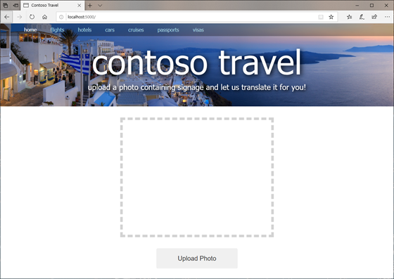
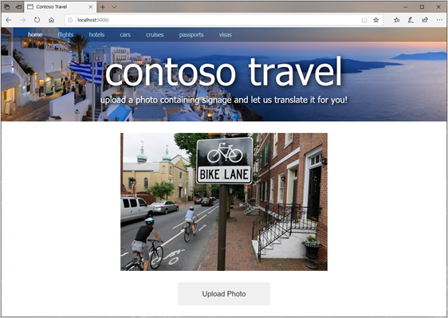

# Create a site to upload photos

[Prerequisite: Getting started with Flask](./flask.md)

Now that you have an environment for Python and Flask prepared and have the basics of Flask under your belt, it’s time to build a website. Our Flask website begins with an **app.py** file and basic assets such as HTML, CSS, and images. You will start by using [Git](https://en.wikipedia.org/wiki/Git) to download a set of starter files for the Contoso Travel site. Then you will enhance the site to support photo uploads.

## Download the starter site

1. If Git isn’t installed on your computer, go to the [Git website](https://git-scm.com/) and install it now. Versions are available for Windows, macOS, and Linux.
2. In a command window or terminal, use `cd` to switch to the project directory you created in the previous subsection. Then use the following command to clone the GitHub repo containing the starter files for the website:

``` bash
git clone https://github.com/GeekTrainer/ai-workshop-starter.git .
```

> **Note:** Don’t forget to include the period at the end of the command. Otherwise, the files will be copied into a subdirectory of the project directory rather than into the project directory itself.

3. Take a moment to browse the files that were copied into the project directory. Verify that they include:

- **app.py**, which holds the Python code that drives the site
- **templates/index.html**, which contains the site’s home page
- **static/main.css**, which contains CSS to dress up the home page
- **static/banner.jpg**, which contains the website banner
- **static/placeholder.jpg**, which contains a placeholder image for photos that have yet to be uploaded

Here’s what’s currently in **app.py**:

``` python
from flask import Flask, render_template

app = Flask(__name__)

# Define route for the app's one and only page
@app.route("/")
def index():
    return render_template("index.html")
```

4. Return to the command window or terminal where your virtual Python environment is active, and make sure that the project directory is the current directory.

> **Note:** If you closed the command window or terminal after activating the virtual environment, simply open a new one, use cd to switch to the project directory, and use the `env\scripts\activate` command (Windows) or `. env/bin/activate` command (macOS and Linux) to activate it again.

5. Configure Flask to run in development mode by setting the `FLASK_ENV` environmental variable. Running Flask in development mode is helpful when you’re developing a website because Flask automatically reloads any files that change while the site is running. If you let Flask default to production mode and change the contents of an HTML file or other asset, you have to restart Flask to see the change in your browser.

``` bash
# Windows
set FLASK_ENV=development

# macOS or Linux
export FLASK_ENV=development
```

6. Now use the following command to start Flask:

``` bash
flask run
```

7. Open a browser and navigate to `http://localhost:5000`. Confirm the website appears in the browser window as shown below. The page isn't functional yet - that's what we're here to build!



## Add support for uploading photos

In this exercise, you will modify **index.html** and **app.py** so that users can upload photos to the website. You can use any text editor you'd like, but we recommend using [Visual Studio Code](https://code.visualstudio.com/) - Microsoft's free, lightweight source-code editor for Windows, macOS, and Linux that features IntelliSense, integrated Git support, and more.

1. Open the directory containing your website in your code editor. If you are using Visual Studio Code, you can use the command `code .` in your command or terminal window.
2. Open **index.html** in the **templates** folder.
3. Add the `script` block to **index.html** immediately before the closing **</body>** element.

``` html
<script type="text/javascript">
    $(function() {
        $("#upload-button").click(function() {
            $("#upload-file").click();
        });

        $("#upload-file").change(function() {
            $("#submit-button").click();
        });
    });
</script>
```

The code uses [jQuery](https://jquery.com/) for as our client-side framework. While jQuery isn't as popular these days as Angular or React, it will work for our purposes as it doesn't require the setup other frameworks do. The code will display the open file dialog box when the user clicks on **Upload Photo**, and automatically uploads it when the dialog box is dismissed. The code simulates clicks on the buttons on the page:

``` html
<!-- From index.html -->
<div style="display: none">
    <input type="file" id="upload-file" name="file" accept=".jpg,.jpeg,.png,.gif">
    <input type="submit" id="submit-button" value="Upload">
</div>
```

4. Open **app.py** and replace its contents with the following:

``` python
# app.py
import base64
from flask import Flask, render_template, request

app = Flask(__name__)

@app.route("/", methods=["GET", "POST"])
def index():
    if request.method == "POST":
        # Display the uploaded image
        image = request.files["file"]
        uri = "data:;base64," + base64.b64encode(image.read()).decode("utf-8")

    else:
        # Display a placeholder image
        uri = "/static/placeholder.png"

    return render_template("index.html", image_uri=uri)
```

The revised **app.py** still serves up the content in **index.html** when the home page is requested. But when the user uploads a photo and the page is requested again with a `POST` command, the new code retrieves the uploaded image from the request (`image = request.files["file"]`), and then encodes it using base-64 to create a data URI and assigns the data URI to the `` element declared in the page. This is a common technique for displaying an uploaded image in a webpage without writing the image to a temporary file on disk.

5. Return to index.html and find the `` element on line 42. Replace **/static/placeholder.png** on that line with `{{ image_uri }}`.

``` html
<!-- updated markup for index.html -->

```

Notice the `image_uri` variable passed to `render_template()` in the modified **app.py** file. When the page is first requested, `image_uri` points to the placeholder image. When the page is requested again because an image was uploaded, `image_uri` holds the data URI created from the image. Consequently, when the user uploads a photo, the photo replaces the placeholder image on the page.

6. Finish by saving your changes to **index.html** and **app.py**. It’s time to see the results.

## Upload a photo

1. Assuming that Flask is still running in the project directory (if it’s not, you can start it again with a `flask run` command), either refresh the page in your browser or open a new browser instance and navigate to **http://localhost:5000**.
2. Click the **Upload Photo** button and select a photo from your local file system.
3. Confirm the photo appears. Congratulations!! You have a Flask website which accepts photo uploads!



## Summary and next steps

We've seen how to setup a Flask application to allow users to upload images, and to display them on the page. Next we'll see how to [create keys](./create-azure-keys.md) so we can call Computer Vision and Text Analytics.
