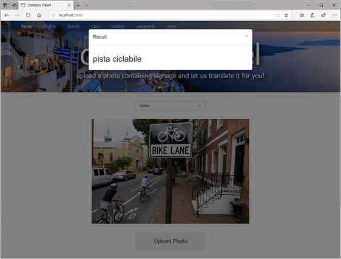

# Use Azure Cognitive Services to translate text

The [Translator Text API](https://azure.microsoft.com/services/cognitive-services/translator-text-api/) is the component of Azure Cognitive Services that translates text from one language to another. It relies on state-of-the-art [Neural Machine Translation (NMT)](https://www.microsoft.com/translator/business/machine-translation/#nmt) to work its magic and supports [more than 60 languages](https://docs.microsoft.com/en-us/azure/cognitive-services/translator/language-support).

Like the Computer Vision API, the Translator Text API is invoked using REST calls over the Internet. Unlike the Computer Vision API, the Translator Text API currently has no Python SDK available. That doesn’t mean that you can’t use it from a Python application. It means that you must invoke the API by using raw HTTPS requests and write code to parse the JSON payloads that are returned.

It’s not as hard as it sounds, as you will prove when you modify the Contoso Travel site to pass text extracted from photos by the Computer Vision API to the Translator Text API for translation into another language.

## Create a Text Translation key

In order to call the Translator Text API, you must obtain an API key. As with the Computer Vision API, this key travels in each request you place to the Translator Text API in an `Ocp-Apim-Subscription-Key` header and maps calls to Azure subscriptions.

1. In a Command Prompt window or terminal, use the following command to subscribe to the Translator Text API and place the resulting resource named **translator-text** in the resource group you created earlier:

``` bash
az cognitiveservices account create --resource-group contoso-travel-rg --name 
translator-text --location global --kind TextTranslation --sku F0 --yes
```

> **NOTE:** Please note the above command is all one line

> **NOTE:** Unlike the Computer Vision API, which requires you to specify an Azure region, the Translator Text API is a "global" API that doesn’t live in a specific region. That’s the reason for the `--location global` parameter. Among other things, this means that you don’t have to retrieve an endpoint URL for the Translator Text API as you do for the Computer Vision API. One endpoint - https://api.cognitive.microsofttranslator.com/translate?api-version=3.0—serves - serves all regions.

2. Use the following command to obtain an API key for the Translator Text API:

``` bash
az cognitiveservices account keys list --resource-group contoso-travel-rg --name translator-text --query key1 --output tsv
```

The output from the command is a string containing numbers and letters. **This is your Translator Text API key**. **Copy the key** into a text file and save it so that can easily retrieve it later. You will need it later in this unit.

> **NOTE:** This API key uses the Text Translator API’s free tier (--sku F0), which supports translating up to 2,000,000 characters of text per month. In a production environment, you would want to subscribe to one of the paid tiers.

## Modify the site to use the Translator Text API

You have now subscribed to the Translator Text API and obtained an API key for calling it. The next step is to modify the Contoso Travel site to use the Translator Text API to translate text extracted from photos with the Computer Vision API.

### Store the Translator Text API key in .env

We are using **dotenv** for managing our environmental variables. We need to update **.env** with our new key. Open **.env** and append the following line:

``` bash
TRANSLATE_KEY=<translate_key>
```

As before, replace `<translate_key>` with the key you just created for Translator Text API.

### Update index.html

1. Open **index.html** and insert the following statements at line 42, **just before** the `` element. This will hard code a list of languages.

``` html
<select id="language" class="form-control" name="language">
    <option value="en">English</option>
    <option value="zh-Hant">Chinese (simplified)</option>
    <option value="zh-Hans">Chinese (traditional)</option>
    <option value="fr">French</option>
    <option value="de">German</option>
    <option value="it">Italian</option>
    <option value="ja">Japanese</option>
    <option value="ko">Korean</option>
    <option value="pt">Portugese</option>
    <option value="es">Spanish</option>
</select>
```

2. Also in **index.html**, add the following statement to the `<script>` block at the bottom of the page:

``` html
$("#language").val("{{ language }}");
```

Here’s how the modified `<script>` block should look:

``` html
<script type="text/javascript">
    $(function() {
        $("#upload-button").click(function() {
            $("#upload-file").click();
        });

        $("#upload-file").change(function() {
            $("#submit-button").click();
        });

        $("#language").val("{{ language }}");
    });
</script>
```

The purpose of the added statement is to initialize the drop-down list with the currently selected language. Without this statement, the drop-down list would revert back to the default language ("English") each time a photo is uploaded.

### Update app.py

1. Open **app.py** and replace the first line with the following. This will import the libraries necessary to make REST calls with Python.

``` python
import os, base64, json, requests
```

2. Add the following statement right after the statements which create the instance of `ComputerVisionClient`

``` python
# Retrieve the Translator Text API key 
translate_key = os.environ["TRANSLATE_KEY"]
```

#### Replace index to add translation support

Replace `index()` with the following code:

``` python
@app.route("/", methods=["GET", "POST"])
def index():
    language="en"

    if request.method == "POST":
        # Display the image that was uploaded
        image = request.files["file"]
        uri = "data:image/jpg;base64," + base64.b64encode(image.read()).decode("utf-8")
        image.seek(0)

        # Use the Computer Vision API to extract text from the image
        lines = extract_text_from_image(image, vision_client)

        # Use the Translator Text API to translate text extracted from the image
        language = request.form["language"]
        translated_lines = translate_text(lines, language, translate_key)

        # Flash the translated text
        for translated_line in translated_lines:
            flash(translated_line)

    else:
        # Display a placeholder image
        uri = "/static/placeholder.png"

    return render_template("index.html", image_uri=uri, language=language)
```

##### Breaking down the code

The new lines of code are what we'll use to call our (soon to be added) function which will call the translator API.

``` python
        language = request.form["language"]
        translated_lines = translate_text(lines, language, translate_key)

        # Flash the translated text
        for translated_line in translated_lines:
            flash(translated_line)
```

We start by reading the language from the form using `request.form["language"]`. We call our helper function `translate_text`, which will be created to return a list of lines of text from the image. And finally, we loop through the result in `translated_lines` adding them to FlashMessages.

#### Add translate_text helper function

Finally, let's add the `translate_text() function to the end of **app.py**.

``` python
def translate_text(lines, language, key):
    uri = "https://api.cognitive.microsofttranslator.com/translate?api-version=3.0&to=" + language

    headers = {
        'Ocp-Apim-Subscription-Key': translate_key,
        'Content-type': 'application/json'
    }

    input=[]

    for line in lines:
        input.append({ "text": line })

    try:
        response = requests.post(uri, headers=headers, json=input)
        response.raise_for_status() # Raise exception if call failed
        results = response.json()

        translated_lines = []

        for result in results:
            for translated_line in result["translations"]:
                translated_lines.append(translated_line["text"])

        return translated_lines

    except requests.exceptions.HTTPError as e:
        return ["Error calling the Translator Text API: " + e.strerror]

    except Exception as e:
        return ["Error calling the Translator Text API"]
```

##### Breaking down the code

``` python
uri = "https://api.cognitive.microsofttranslator.com/translate?api-version=3.0&to=" + language
```

We start by setting the URI for the translator service and specifying our language in the query string. We don't need to specify the source language as it will be automatically detected by the service.

``` python
headers = {
    'Ocp-Apim-Subscription-Key': translate_key,
    'Content-type': 'application/json'
}
```

We then set up a dictionary called `headers`, which will store both the key and the return type (JSON).

``` python
for line in lines:
    input.append({ "text": line })
```

The API expects each line as an object with a single property called `text`. This section handles that conversion.

``` python
    response = requests.post(uri, headers=headers, json=input)
    response.raise_for_status() # Raise exception if call failed
    results = response.json()

    translated_lines = []

    for result in results:
        for translated_line in result["translations"]:
            translated_lines.append(translated_line["text"])

    return translated_lines
```

We then use [Requests](https://2.python-requests.org/en/master/), the de facto standard for Python for making HTTP(S) calls. `post` indicates a POST call, and we specify the `uri` to call, our `headers`, which contains the key, and `json`, which is the text we wish to have translated. We specify we want errors to be raised if we don't receive a 200 response by calling `raise_for_status()`. Finally, we retrieve the results by calling `json()`.

Similar to before, we loop through the results and append them to a list called `translated_lines`, and return the value.

## Test the site

The last (and best?) step is to test our changes! Refresh the browser window from before (or navigate to **http://localhost:5000**). It should look something like this:


Select the target language for translation (the language you want to translate **to**). Select an image with text, and then click **Upload Photo**. You should see the translated text in the dialog box!



## Summary and next steps

Congratulations! You've now built a fully function translation site!

You may notice some of the translations aren't as accurate as one might like. Performing translations is a challenging problem. Various idioms aren't always picked up well by automated services, and context is often lacking. But the service should provide a serviceable translation. One we should be willing to [deploy and share](./deployment.md)!
