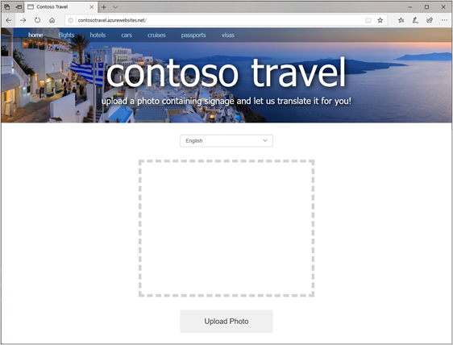

# Create an Azure App Service

[Prerequisite: Translating text](./translator.md)

[Azure App Service](https://azure.microsoft.com/en-us/documentation/articles/app-service-value-prop-what-is/) is a set of services provided by Microsoft Azure to enable developers to easily build and deploy web apps. Included in the App Service family are [Azure Web Apps](https://azure.microsoft.com/en-us/documentation/articles/app-service-web-overview/), which allow you to quickly and easily deploy websites built with tools and languages you’re already familiar with.

Azure Web Apps make deploying websites extraordinarily easy—and not just websites built using the Microsoft stack. You can deploy Python apps that use MySQL just as easily as ASP.NET apps that use SQL Server. You can select from a wide variety of Azure Web App templates or build templates of your own. You can configure Azure Web Apps to auto-scale as traffic increases to ensure that your customers aren’t left waiting during periods of peak demand. You can publish apps to staging locations and test them in the cloud before taking them live, and then swap staging and production with the click of a button. You can even create [WebJobs](https://docs.microsoft.com/azure/app-service/webjobs-create) - programs or scripts that run continuously or on a schedule to handle billing and other time-critical tasks. In short, Azure Web Apps take the pain out of publishing and maintaining web apps and are just as suitable for a personal photo-sharing site as they are for enterprise-grade sites serving millions of customers.

In this unit, you will deploy Contoso Travel to Azure as an Azure Web App so it can be accessed by anyone, from anywhere, using a browser. And you will learn about App Service application settings, which allow API keys and other “secrets” used by an application to be stored securely in the cloud.

## Deploying to Azure

`az webapp up` is an Azure CLI component which will create the necessary components in Azure for hosting your website, and perform a [ZIP deploy](https://docs.microsoft.com/en-us/azure/app-service/deploy-zip) of your current directory.

After deploying your application, Azure will automatically install all packages listed in **requirements.txt**, and run your **app.py** file. The process will take a few minutes to complete, but only requires one command to start the process.

### Performing the deployment

In a command or terminal window, execute the following command, **making sure you replace the placeholder of APP_NAME with a unique name**.

> **NOTE:** This command **must** be executed in the same directory as your code.

``` bash
az webapp up -n APP_NAME --resource-group contoso-travel-rg --location northcentralus
```

> **NOTE:** As before, the command should be executed on line line of code.

> **NOTE:** We are deploying our site to **northcentralus**, in the same location as our existing resources.

## Add application settings

When you ran your website locally, it used `os.environ` to load API keys for Cognitive Services. In order for the site to run in Azure, these same settings need to be added to the Azure App Services [application settings](https://docs.microsoft.com/azure/app-service/configure-common).

1. Run the following CLI command to create an application setting named **VISION_API_KEY**, replacing **APP_NAME** with the name assigned to your App Service and **computer_vision_api_key** with your Computer Vision API key:

``` bash
az webapp config appsettings set -g contoso-travel-rg -n APP_NAME --settings VISION_KEY=computer_vision_api_key
```

2. Now use this command to create an application setting named **VISION_ENDPOINT** replacing **endpoint** with your Computer Vision API endpoint:

``` bash
az webapp config appsettings set -g contoso-travel-rg -n APP_NAME --settings VISION_ENDPOINT=endpoint
```

3. Finish up by using the following command to load your Translator Text API key into application settings, replacing **translate_api_key** with your API key:

``` bash
az webapp config appsettings set -g contoso-travel-rg -n APP_NAME --settings TRANSLATE_API_KEY=translate_api_key
```

## Run the website

Now it's time to see your site in the real world! Open your browser and navigate to **https://APP_NAME.azurewebsites.net**, replacing **APP_NAME** with the name of your application. Confirm everything is running properly.



## Final Summary

In this module, you learned the basics of building websites in Python by using the Flask framework. You learned that Python code goes typically in a file named **app.py** and, code in that file calls Flask functions such as `render_template()` and `flash()`. You also learned how to programmatically inject content into HTML templates by using Flask expressions, and how to use `@app.route()` to connect functions in your code to routes supported by the application. Finally, you learned how easy it is to use the Azure CLI's `az webapp up` command to upload a website that you have written and tested locally to an Azure App Service.

In addition, you discovered that you can use Azure Cognitive Services to build intelligent applications infused with AI. The Computer Vision API extracts text from images and identifies objects in those images, among other tasks. It can even generate captions for the images you upload. And the Translator Text API translates text among dozens of languages. Combined with other Cognitive Services, these APIs make it possible to write apps that you could only have dreamed about just a few short years ago.
